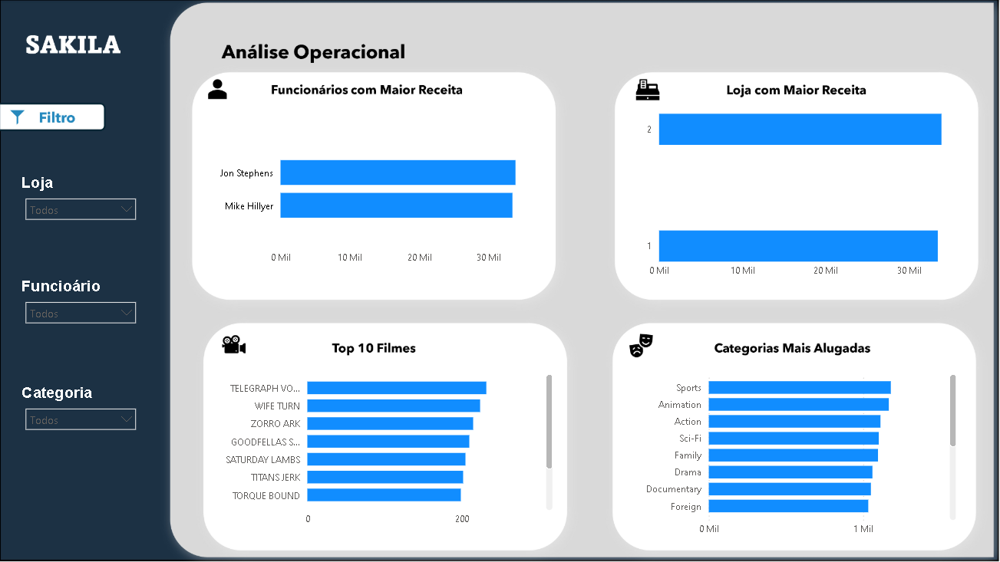

# 🎬 Dashboard Power BI + MySQL | Sakila

Projeto de análise de dados desenvolvido utilizando **Power BI**, **MySQL** e a base **Sakila**.

O objetivo do projeto foi transformar dados transacionais de uma locadora de filmes em insights estratégicos, operacionais e de performance de clientes.

---

## 🚀 Tecnologias utilizadas

- Power BI
- MySQL
- SQL
- GitHub

---

## 📊 Estrutura do Dashboard

### 📈 Análise Estratégica
- Receita Total
- Ticket Médio
- Receita por País
- Faturamento Mensal

### 👥 Performance de Clientes
- Top 10 Clientes
- Top 10 Cidades por Receita
- Ticket Médio

### ⚙️ Análise Operacional
- Funcionários com maior receita
- Top Filmes
- Categorias mais alugadas

---

## 📸 Preview do Dashboard

### Página 1

---

## 🛠️ SQL

As consultas SQL e Views utilizadas estão disponíveis no arquivo `views.sql`.

---

## 📌 Objetivo do Projeto

Projeto criado com foco em portfólio para a área de **Análise de Dados**, demonstrando habilidades em SQL, Power BI e visualização de dados.
